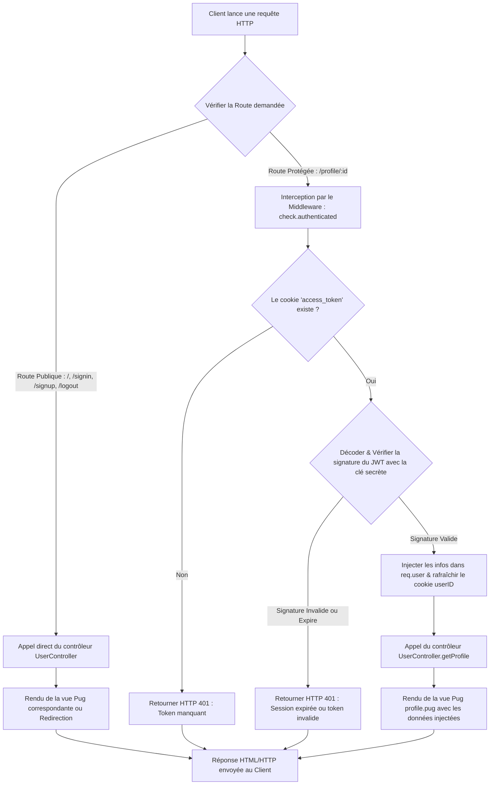
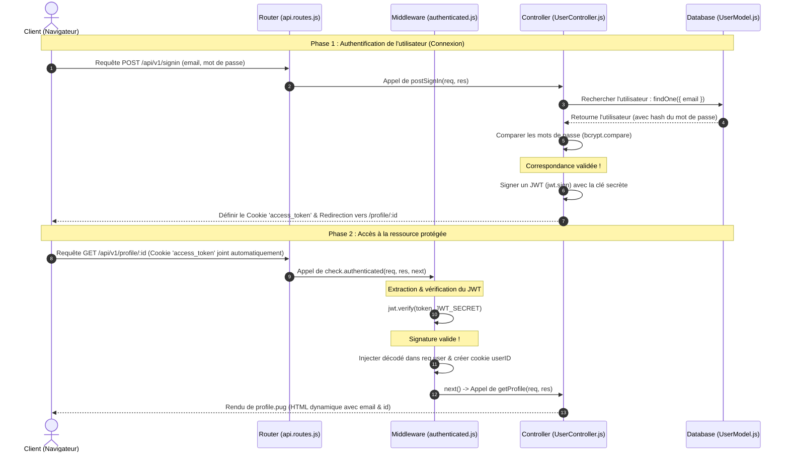
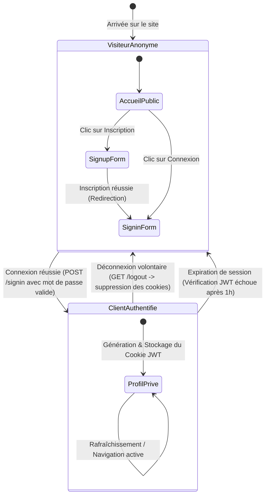

# 04. Diagrammes et Cinématiques

Pour bien comprendre comment les fichiers interagissent et comment les requêtes circulent à travers l'application, voici trois diagrammes modélisant précisément les flux d'exécution et les états du système.

---

## 1. Diagramme de Flux (Flowchart)

Ce diagramme montre le cheminement d'une requête HTTP arrivant sur le serveur. Il met en évidence le filtrage effectué par le middleware de sécurité pour rejeter ou valider les accès.

---

## 2. Diagramme de Séquence : Connexion & Accès Profil

Ce diagramme modélise l'échange de messages et d'informations dans le temps entre le Navigateur (Client), le Routeur, le Middleware, le Contrôleur et la Base de données Mongoose lors d'une connexion réussie suivie de l'accès à la page privée.

---

## 3. Diagramme d'État : Cycle de vie de la Session

Ce schéma modélise les différents états de navigation et de session dans lesquels un visiteur peut se trouver, et les transitions associées aux actions utilisateur ou d'expiration de session.

