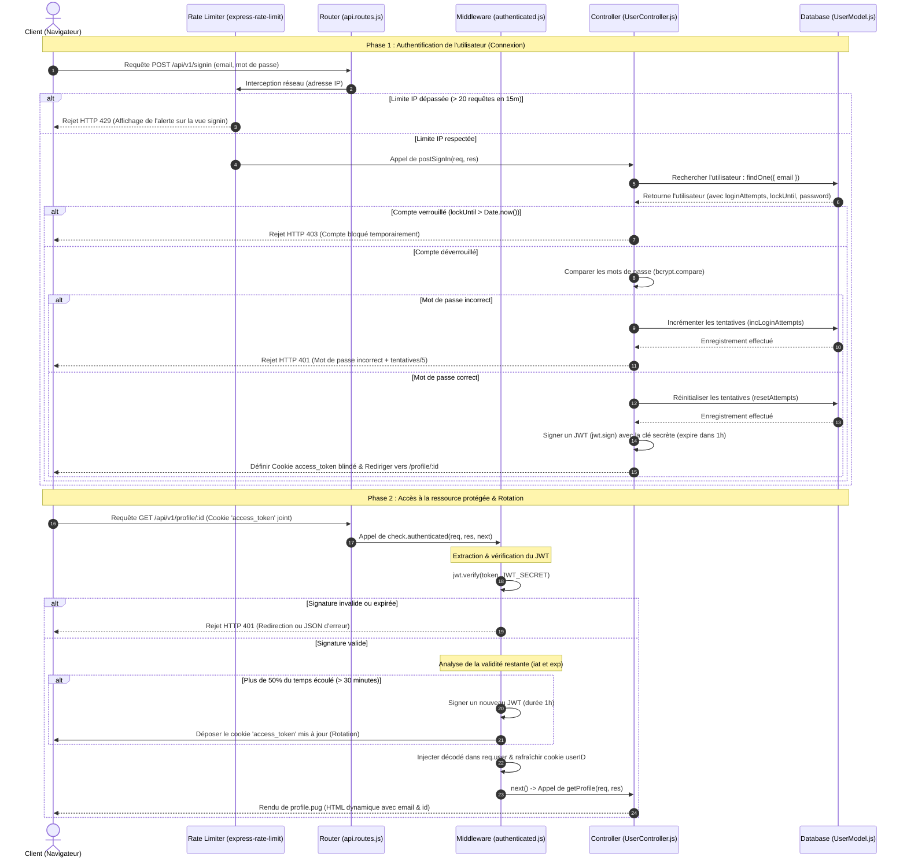
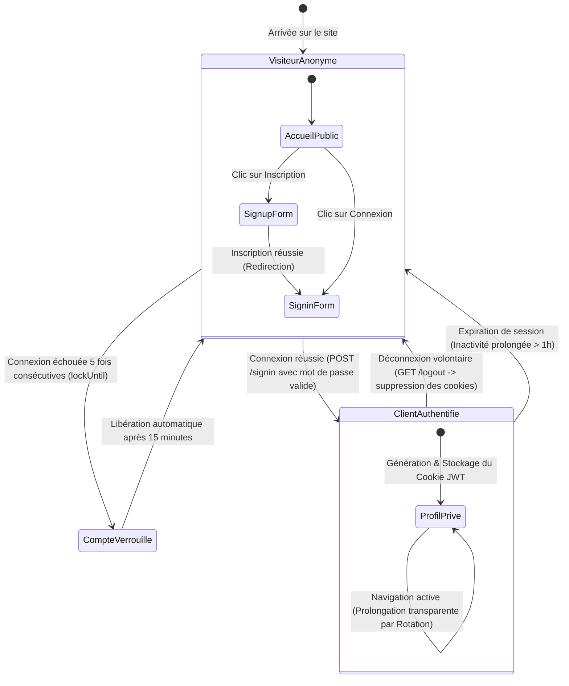

# 04. Diagrammes et Cinématiques (Mis à Jour)

Pour bien comprendre comment les fichiers interagissent et comment les requêtes circulent à travers l'application avec nos nouvelles mesures de protection (IP Rate Limiting, Account Lockout et Sliding Session), voici trois diagrammes mis à jour modélisant précisément les flux de sécurité et les états du système.

---

## 1. Diagramme de Flux (Flowchart)

Ce diagramme montre le cheminement d'une requête HTTP arrivant sur le serveur. Il met en évidence les interceptions par l'IP Rate Limiter au niveau réseau, le verrouillage de compte en base de données, et la rotation de jeton à mi-parcours de la session.

```mermaid
flowchart TD
    A["Client lance une requête HTTP"] --> B{"Vérifier la Route demandée"}
    
    %% Routes Publiques %%
    B -->|Route Publique : /, /signin, /signup, /logout| C{"Est-ce un POST /signin ou /signup ?"}
    C -->|Oui| C1{"Interception par le Rate Limiter"}
    C1 -->|IP Bloquée (requêtes > 20 en 15m)| C2["Retourner HTTP 429 : Trop de requêtes"]
    C1 -->|IP Autorisée| D1["Appel du contrôleur UserController"]
    C -->|Non| D1
    
    D1 --> D["Rendu de la vue Pug ou Redirection"]
    D --> E["Réponse HTML/HTTP envoyée au Client"]
    C2 --> E
    
    %% Routes Protégées %%
    B -->|Route Protégée : /profile/:id| F["Interception par le Middleware : check.authenticated"]
    F --> G{"Le cookie 'access_token' existe ?"}
    
    G -->|Non| H["Retourner HTTP 401 : Token manquant"]
    H --> E
    
    G -->|Oui| I{"Décoder & Vérifier la signature du JWT avec la clé secrète"}
    I -->|Signature Invalide ou Expire| J["Retourner HTTP 401 : Session expirée ou token invalide"]
    J --> E
    
    I -->|Signature Valide| K{"Vérifier la validité restante du JWT"}
    K -->|"> 50% du temps écoulé (> 30 min)"| K1["Générer un nouveau JWT (Sliding Session) & Réémettre le cookie"]
    K -->|"< 50% du temps écoulé"| K2["Continuer sans modification"]
    
    K1 --> L["Injecter les infos dans req.user & rafraîchir cookie userID"]
    K2 --> L
    
    L --> M["Appel du contrôleur UserController.getProfile"]
    M --> N["Rendu de la vue profile.pug avec email & id"]
    N --> E
```

---

## 2. Diagramme de Séquence : Connexion Secouée, Verrouillage & Rotation

Ce diagramme modélise l'échange de messages dans le temps entre tous les participants, illustrant :
- Le filtrage par le Rate Limiter réseau.
- L'incrémentation des tentatives et le verrouillage Mongoose en cas d'erreurs répétées.
- Le renouvellement automatique du jeton par le middleware (Sliding Session).



---

## 3. Diagramme d'État : Cycle de vie de la Session

Ce schéma intègre le nouvel état de **Compte Verrouillé (Lockout)** suite aux échecs successifs de mot de passe, ainsi que la prolongation dynamique.



